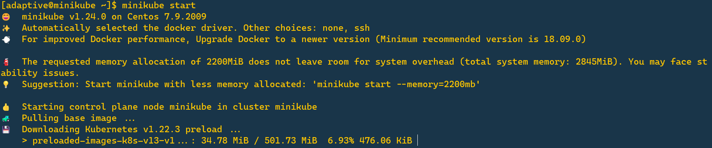

# Minikube 
minikube is local Kubernetes, focusing on making it easy to learn and develop for Kubernetes.

All you need is Docker and Minikube installed.

## Environment
```bash
- Virtual Machine ( CentOS 7 )
- 2 GB of RAM
- 20 GB of Free Disk
- 2 VCPUs
- Docker Installed
```

## Install Docker
```bash
sudo yum install docker -y
sudo systemctl enable docker
sudo systemctl start docker
```
### If Got Permission Denied Issue
```bash
sudo groupadd docker
sudo usermod -aG docker $USER
sudo usermod -aG docker $USER
# and then restart
```
## Install Minikube 
```
curl -LO https://storage.googleapis.com/minikube/releases/latest/minikube-linux-amd64
sudo install minikube-linux-amd64 /usr/local/bin/minikube
```
## Minikube Start
```bash
minikube start
```


wait until the cluster ready!

source : `https://minikube.sigs.k8s.io/docs/start/`